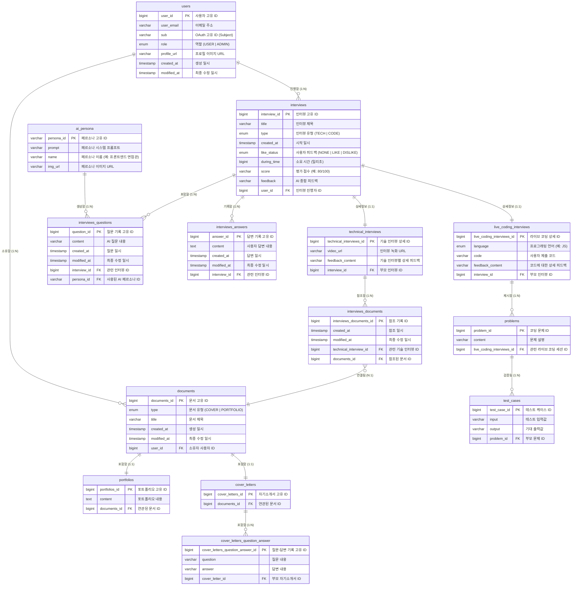

# Entity Relationship Diagram (ERD)

## Diagram

## 모듈 설명 (Module Descriptions)

### 1. 사용자 모듈 (`users`)
- **핵심 엔티티**: 애플리케이션 사용자를 나타냅니다.
- **관계**: 한 사용자는 여러 개의 문서를 소유할 수 있고, 여러 번의 인터뷰를 진행할 수 있습니다.

### 2. 문서 모듈 (`documents`, `cover_letters`, `portfolios`)
- **Document**: 사용자가 업로드하거나 생성한 문서의 추상적인 부모 엔티티입니다.
- **다형성**: 문서는 실제 데이터 유형에 따라 **자기소개서(Cover Letter)** 또는 **포트폴리오(Portfolio)** 로 나뉩니다.
    - `cover_letters`: 질문-답변(`cover_letters_question_answer`) 형태의 구조화된 데이터를 저장합니다.
    - `portfolios`: 원본 텍스트/마크다운(`content`) 데이터를 저장합니다.

### 3. 인터뷰 모듈 (`interviews`, `technical_interviews`, `live_coding_interviews`)
- **Interview**: 인터뷰 세션의 핵심 기록입니다. 전체 상태, 소요 시간, 점수 등을 추적합니다.
- **유형**:
    - **기술 면접** (`technical_interviews`): 구두 질의응답에 중점을 둡니다. `interviews_documents`를 통해 사용자의 문서를 참조할 수 있습니다.
    - **라이브 코딩 면접** (`live_coding_interviews`): 코드 작성 및 문제 해결에 중점을 둡니다. `test_cases`를 통해 `problems`를 검증합니다.
- **상호작용**:
    - `interviews_questions`: AI가 생성한 질문입니다.
    - `interviews_answers`: 사용자의 답변(음성 텍스트 변환 또는 텍스트 입력)입니다.

### 4. AI 엔진 (`ai_persona`)
- **역할**: 다양한 AI 페르소나(예: "깐깐한 백엔드 면접관", "친절한 인사담당자")를 정의합니다.
- **활용**: 인터뷰의 각 질문은 특정 페르소나와 연관되어 있어, 다중 페르소나 인터뷰나 특정 역할극(Role-play) 시나리오를 가능하게 합니다.
