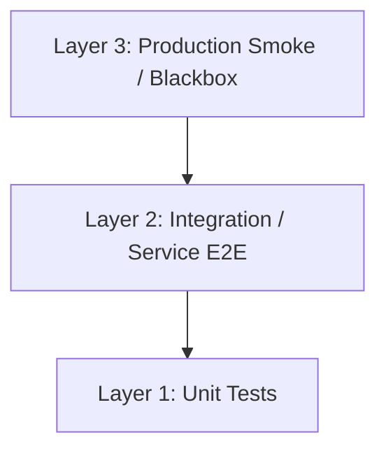

# Test Strategy & Architecture

## Overview: The Testing Pyramid
안정적인 서비스를 위해 3단계 계층화된 테스트 전략을 채택합니다.
각 단계는 **격리 수준(Isolation)**과 **실제 환경 유사도(Realism)**에 따라 명확히 구분됩니다.

---

## Layer 1: Unit Tests (Whitebox / Small)
**"빠르고 결정적(Deterministic)인 로직 검증"**

- **범위**: 클래스/함수 1개 수준. 외부 의존성(DB, Network) Zero.
- **대상**:
  - 도메인 규칙 (Entity 메서드)
  - 서비스 분기 로직 (비즈니스 흐름)
  - 정책 (Policy, Guards w/o DB)
- **위치**: `test/unit/**/*.spec.ts`
- **실행**: `npm run test:unit`
- **구현 원칙**:
  - Repository, 외부 API, Redis 등 모든 의존성은 **Mocking** 처리.
  - 테스트 속도가 매우 빨라야 함(ms 단위).

---

## Layer 2: Integration (API w/ mocked externals)
**"HTTP 요청 기반 + 외부 API mock + DB/Redis 실제"**

- **범위**: NestJS 앱 전체 로딩. **외부 API만 Mocking**, DB/Redis는 **실제(Test Env)** 사용.
- **대상**:
  - 라우팅 / 가드 / 파이프 / 필터 / 인터셉터의 실제 동작 확인.
  - HTTP 요청/응답 스펙 (Status Code, Body Schema).
  - DB 트랜잭션 및 쿼리 동작 확인.
- **위치**:
  - `test/blackbox/**/*.blackbox-test.ts`
  - `test/e2e/**/*.e2e-test.ts`
- **실행**: `npm run test:blackbox` (기본: `runInBand`)

### Isolation Policy (DB/Redis 격리)
- **Default**: `runInBand` (순차 실행) 사용을 기본으로 하여 자원 경합 방지.
- **Parallel Execution**: 병렬 실행이 필요한 경우, `JEST_WORKER_ID`를 기반으로 DB Schema/Redis DB Index를 분리해야 함.
  - 예: `test_db_1`, `test_db_2` ...

---

## Layer 3: Blackbox API Tests (Production Smoke / Large)
**"배포 환경에서의 최후 생존 확인"**

- **범위**: 실제 배포 환경(Staging/Prod). **모든 외부 연동 실제 사용**.
- **대상**:
  - 배포가 정상적으로 완료되었는가?
  - 핵심 시나리오(Critical Path)가 끊김 없이 동작하는가?
  - 외부 서비스(Google, Clova) 연동 및 네트워크 상태 확인.
- **위치**: `test/smoke` (권장) 또는 특정 `blackbox` 테스트의 Production Mode 실행.
- **구현 원칙**:
  - Mocking 금지.
  - 시나리오는 최소화 (불안정성 최소화).

### Smoke Policy
- **Failure Handling**: 외부 연동 실패(예: Clova API Timeout)는 **"DOWN"이 아닌 "DEGRADED"**로 간주.
- **Deployment Block**: 단건 실패로 즉시 배포를 차단하지 않으며, **연속 N회 실패 시** 또는 **Core API(자체 로직) 실패 시**에만 차단하도록 정책 제어.

---

## Layer Responsibility Mapping (무엇을 어디서 테스트하는가?)

| Test Case | Layer 1 (Unit) | Layer 2 (Integration) | Layer 3 (Smoke) |
| :--- | :---: | :---: | :---: |
| **Domain Logic** (Entity 규칙) | ✅ (Primary) | - | - |
| **Service Logic** (분기/계산) | ✅ (Primary) | - | - |
| **Routing / DTO Validation** | - | ✅ (Real Pipe/Filter) | - |
| **Auth / Guards** (Context) | ✅ (Mocked) | ✅ (Real Token) | - |
| **DB Query / Transaction** | - | ✅ (Real DB) | - |
| **Error Response (4xx/5xx)** | - | ✅ (Check Body/Status) | - |
| **External API Integration** | - | ✅ (Mocked Contract) | ✅ (Real Connection) |
| **Deployment Health** | - | - | ✅ (Alive check) |

### Guide Table
- **404 Not Found**: Layer 2에서 URL 라우팅 검증.
- **400 Bad Request**: Layer 2에서 DTO Validation 파이프 검증.
- **Service의 if/else 복잡도**: Layer 1에서 집중 검증.
- **DB Unique Constraint**: Layer 2에서 실제 Insert 시도하며 검증.
- **Clova API 응답 포맷 변경**: Layer 3에서 감지 (또는 Layer 2의 Contract Test).

## References

- **[Practical Test Pyramid](https://martinfowler.com/articles/practical-test-pyramid.html)** (Martin Fowler)
  - 유닛 테스트를 가장 많이 두고(빠르고 결정적), 통합/엔드투엔드는 최소화해(느리고 불안정) 유지보수성과 속도를 확보하는 업계 표준 테스트 전략.

- **[Test Sizes](https://testing.googleblog.com/2010/12/test-sizes.html)** (Google Testing Blog)
  - Small(유닛), Medium(통합), Large(종단) 테스트 분류 체계. "격리 수준/실제성"을 구조적으로 설명하는 근거 자료.

- **[Mocking Principles & Test Doubles](https://abseil.io/resources/swe-book/html/ch14.html)** (Google/Abseil)
  - 테스트 더블(mock/stub) 사용 원칙과 유닛 테스트 적절성, 통합 단계에서의 mock 불일치 위험 관리 가이드.

- **[Testing Strategies in Pipeline](https://minimumcd.org/minimumcd/continuous-integration/testing-strategies/)** (Minimum CD)
  - "배포가 필요한 테스트(실환경 스모크/E2E)는 CI 단계가 아닌 배포 파이프라인/배포 후 수행"하는 테스트 분리 원칙 설명 (Layer 3 근거).

- **[Contract Testing Overview](https://docs.pact.io/)** (Pact Docs)
  - 외부 연동 Mocking 시 발생할 수 있는 "스키마 불일치" 문제를 해결하기 위한 Consumer-Driven Contract Testing 접근법 (Layer 2 보완책).

- **[Contract Testing Guide](https://openliberty.io/guides/contract-testing.html)** (Open Liberty)
  - Pact를 활용한 계약 테스트 실제 운영 튜토리얼 및 사례.

- **[Jest Integration Tests in Parallel](https://dev.to/cseby92/how-to-run-jest-integration-tests-in-parallel-using-isolated-sql-schemas-1bm7)**
  - `JEST_WORKER_ID`를 활용하여 Worker별로 DB 스키마를 격리하고 병렬 실행하는 실전 패턴 (Layer 2 격리 전략).

- **[Jest Environment Variables](https://jestjs.io/docs/environment-variables)** (Jest Docs)
  - `JEST_WORKER_ID` 등 공식 환경 변수 문서, 병렬 실행 전략의 기술적 근거.